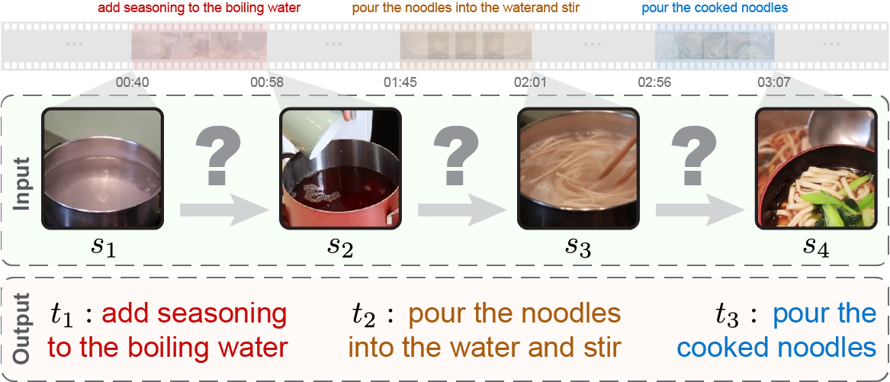

# Visual Transformation Telling

Official repository for ["Visual Transformation Telling"](https://github.com/hughplay/VTT).

<!--  -->


**Figure:** **Visual Transformation Telling (VTT).** Given *states*, which are images extracted from videos, the goal is to reason and describe *transformations* between every two adjacent states.

> **Visual Transformation Telling** <br>
> Wanqing Cui*, Xin Hong*, Yanyan Lan, Liang Pang, Jiafeng Guo, Xueqi Cheng <br>
> (* equal contribution)
<!-- > *Published on Github* -->

<!-- [](https://hongxin2019.github.io) -->
[](https://github.com/hughplay/VTT)
[](https://arxiv.org/abs/2305.01928)
[](https://pytorch.org/get-started/locally/)
[](https://pytorchlightning.ai/)
[](https://hydra.cc)

<!-- ## News

- [x] **[2024-06-21]** Initial release of the DeepCodebase. -->

## Description

**Motivation:** Humans can naturally reason from superficial state differences (e.g. ground wetness) to transformations descriptions (e.g. raining) according to their life experience.
In this paper, we propose a new visual reasoning task to test this transformation reasoning ability in real-world scenarios, called **V**isual **T**ransformation **T**elling (VTT).

**Task:** Given a series of states (i.e. images), VTT requires to describe the transformation occurring between every two adjacent states.


If you find this code useful, please star this repo and cite us:

```
@misc{cui2024visual,
      title={Visual Transformation Telling},
      author={Wanqing Cui and Xin Hong and Yanyan Lan and Liang Pang and Jiafeng Guo and Xueqi Cheng},
      year={2024},
      eprint={2305.01928},
      archivePrefix={arXiv},
      primaryClass={cs.CV}
}
```


## Dataset

VTT dataset can be downloaded at [Google Drive](https://drive.google.com/file/d/1o6-Ev0lmOwzyUAIUqlGOjfJJ1eIcxLzJ).

## Environment Setups

**1. Clone the repository**

```bash
git clone https://github.com/hughplay/VTT.git
cd VTT
```

**2. Prepare the dataset and pretrained molecular encoder weights**

Download the [vtt.tar.gz](https://drive.google.com/file/d/1o6-Ev0lmOwzyUAIUqlGOjfJJ1eIcxLzJ) and decompress it under the `data` directory.

```
mkdir data
cd data
unzip  vtt.tar.gz
```


After decompress the package, the directory structure should be like this:

```
.
`-- dataset
    `-- vtt
        |-- states
        |  |-- xxx.png
        |   `-- ...
        `-- meta
            `-- vtt.jsonl
```

**3. Build the docker image and launch the container**

```bash
make init
```

For the first time, it will prompt you the following configurations (enter for the default values):
```
Give a project name [vtt]:
Code root to be mounted at /project [.]:
Data root to be mounted at /data [./data]:
Log root to be mounted at /log [./data/log]:
directory to be mounted to xxx [container_home]:
`/home/hongxin/code/vtt/container_home` does not exist in your machine. Create? [yes]:
```

After `Creating xxx ... done`, the environment is ready. You can run the following command to go inside the container:

```bash
make in
```

## Training

In the container, train a classical model (e.g. TTNet) by running:

```bash
python train.py experiment=sota_v5_full
```

> Note:
You may need to learn some basic knowledge about [Pytorch Lightning](https://pytorchlightning.ai/) and [Hydra](https://hydra.cc/) to better understand the code.

Tune LLaVA with LoRA:

```bash
zsh scripts/training/train_vtt_concat.sh
```

## Testing
To test a trained classical model, you can run:

```bash
python tset.py <train_log_dir>
```

To test MLMs (e.g. Gemini Pro Vision), you can run:

```bash
python test_gemini.py
```

(modify paths accordingly)


## Detailed results

- human evaluation results: [docs/lists/human_results](docs/lists/human_results)
- MLMs predictions: [docs/lists/llm_results/](docs/lists/llm_results)


## LICENSE

The code is licensed under the [MIT license](./LICENSE) and the VTT dataset is licensed under the <a rel="license" href="http://creativecommons.org/licenses/by-nc/4.0/">Creative Commons Attribution-NonCommercial 4.0 International License</a>.

<br>

*This is a project based on [DeepCodebase](https://github.com/hughplay/DeepCodebase) template.*
